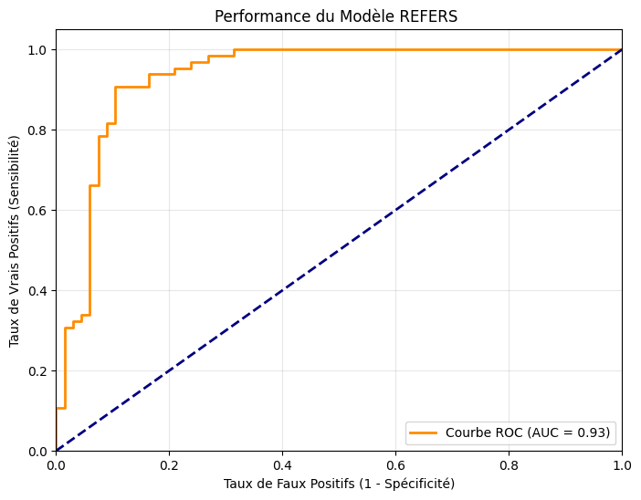
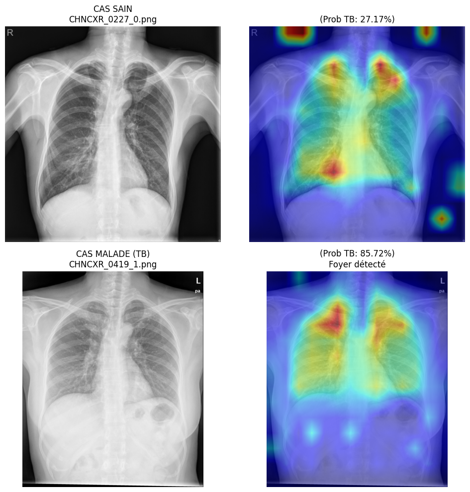

# REFERS: Generalized Radiograph Representation Learning

> **Evaluation of Cross-Modal Transformers (REFERS) for Data-Efficient Tuberculosis Screening and proposal of an Anatomically-Aware architecture.**

## 🔍 Project Overview

In medical imaging, the scarcity of annotated data limits the performance of standard CNNs. This project evaluates **REFERS** (Review-Enhanced Few-Shot Enzyme for Radiology Scans), a **Vision Transformer (ViT)** architecture that leverages free-text radiology reports for supervision.

**Key Engineering Objectives:**
1.  **Reproducibility:** Validate the transfer learning capabilities of REFERS on the **Shenzhen Tuberculosis Dataset**.
2.  **Robustness Analysis:** Evaluate performance in "Low-Data" regimes compared to traditional CNNs.
3.  **Explainability:** Analyze decision boundaries using Self-Attention Heatmaps.
4.  **Novel Contribution:** Propose **"Physio-REFERS"**, a hybrid Graph-Transformer architecture to solve the lack of spatial reasoning in ViTs.

---

## 📊 Experimental Results (Shenzhen Dataset)

We fine-tuned the pre-trained ViT-B/16 backbone on the Shenzhen TB dataset (binary classification: Normal vs. Tuberculosis).

| Metric | Score | Analysis |
| :--- | :--- | :--- |
| **AUC (ROC)** | **0.93** | Excellent separability between classes. |
| **Inference** | ~45ms | Real-time capable on T4 GPU. |

### 📈 ROC Curve & Performance
The model achieves an Area Under Curve (AUC) of **0.93**, demonstrating that report-supervised features generalize exceptionally well to specific pathologies like Tuberculosis, even with limited fine-tuning data (~600 images).

---

## Explainability & Interpretability

To validate the model's reliability (and avoid shortcut learning), we extracted **Attention Maps** from the final Transformer block.

**Clinical Correlation:**
* **Top Row (Normal):** The attention is diffuse across the lung field. No focal point.
* **Bottom Row (Tuberculosis):** The model explicitly attends to the **upper right lung opacity** (typical TB presentation), validating that the ViT has learned relevant biomarkers.

---

## 📉 Limitations & Critical Analysis

While performance on the standardized Shenzhen dataset is high, our experiments on heterogeneous datasets (e.g., COVID-19) highlighted **major limitations**:

1.  **Lack of Inductive Bias:** Unlike CNNs, pure Transformers lack inherent translation invariance. They treat images as unordered patches, making them data-hungry and unstable on noisy datasets.
2.  **Anatomical Blindness:** The model does not "know" anatomy; it learns statistical correlations. This can lead to errors if the patient positioning varies slightly (Domain Shift).

---

## Proposed Contribution: Physio-REFERS

To address the lack of anatomical reasoning in REFERS, we propose a novel architecture extension: **Physio-REFERS**.

### The Concept: Dual-Stream Architecture
We propose injecting explicit anatomical priors into the Vision Transformer via a Graph Neural Network (GNN).

1.  **Stream A (Visual):** Standard REFERS ViT extracting texture/opacity features.
2.  **Stream B (Structural):** A GNN encoding key anatomical landmarks (Clavicles, Heart, Apex, Diaphragm) and their spatial relationships.
3.  **Fusion:** A **Cross-Attention** mechanism where Visual Tokens query the Anatomical Graph to ensure the detected lesion is consistent with human anatomy.

### Why this is better?

| Feature | Current REFERS (ViT) | Proposed Physio-REFERS |
| :--- | :--- | :--- |
| **Spatial Reasoning** | Weak (Positional Embeddings only) | **Strong** (Explicit Graph Edges) |
| **Data Efficiency** | Low (Requires massive datasets) | **High** (Graph guides learning) |
| **Robustness** | Sensitive to noise/artifacts | **Robust** via anatomical constraints |

---

## 🛠️ Repository Structure

REFERS-Evaluation/
├── README.md                          
├── LICENSE                            
├── requirements.txt                   
├── .gitignore                         
│
├── Part1-REFERS-Evaluation/          
│   ├── REFERS.ipynb
│   └── results/
│
└── Part2-Physio-REFERS/              
    ├── README.md                     
    ├── Physio_REFERS_Implementation.ipynb
    └── results/                      
