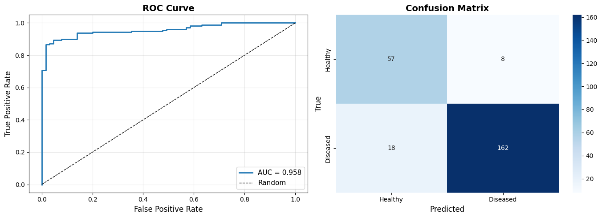
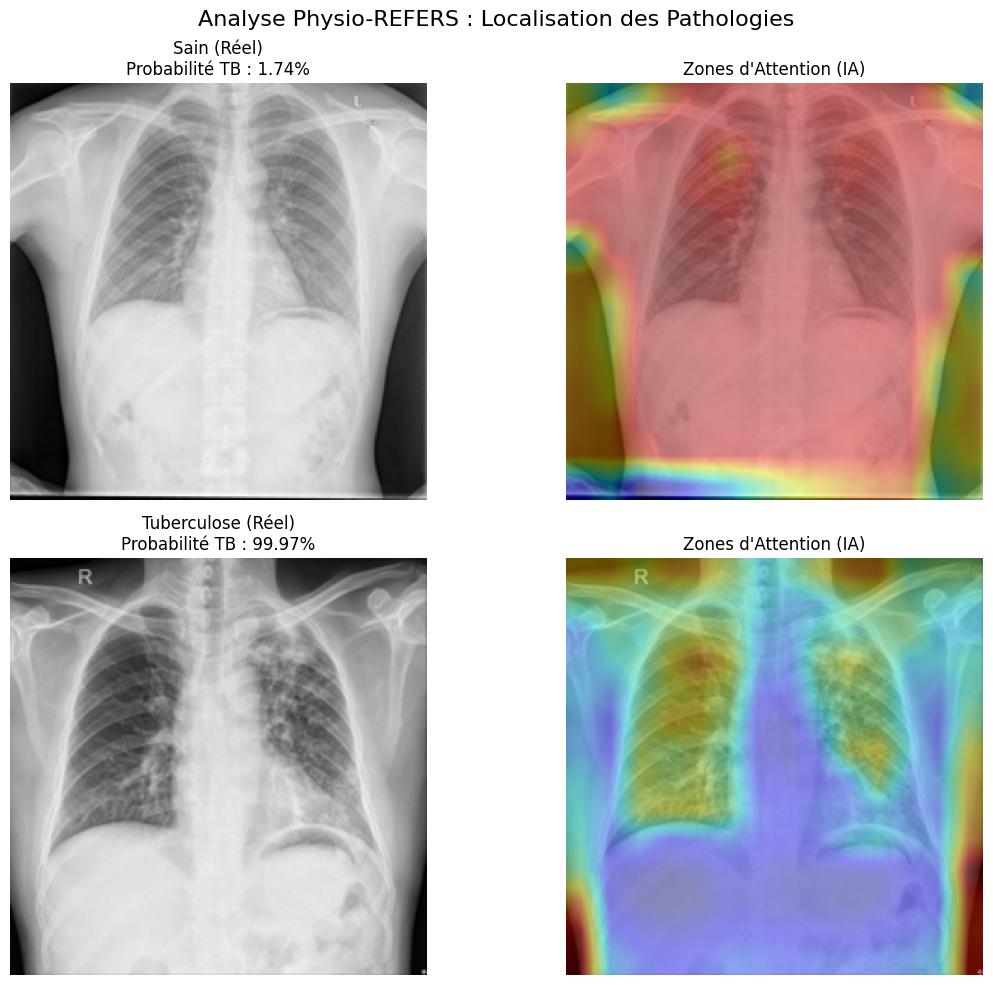

# REFERS: Generalized Radiograph Representation Learning

[](https://www.python.org/)
[](https://pytorch.org/)
[]()

> **Evaluation of Cross-Modal Transformers (REFERS) for Data-Efficient Tuberculosis Screening and proposal of an Anatomically-Aware architecture.**

## 🔍 Project Overview

In medical imaging, the scarcity of annotated data limits the performance of standard CNNs. This project evaluates **REFERS** (Review-Enhanced Few-Shot Enzyme for Radiology Scans), a **Vision Transformer (ViT)** architecture that leverages free-text radiology reports for supervision.

**Key Engineering Objectives:**
1.  **Reproducibility:** Validate the transfer learning capabilities of REFERS on the **Shenzhen Tuberculosis Dataset**.
2.  **Robustness Analysis:** Evaluate performance in "Low-Data" regimes compared to traditional CNNs.
3.  **Explainability:** Analyze decision boundaries using Self-Attention Heatmaps.
4.  **Novel Contribution:** Propose **"Physio-REFERS"**, a hybrid Graph-Transformer architecture to solve the lack of spatial reasoning in ViTs.

---

## 📊 Experimental Results (Shenzhen Dataset)

We fine-tuned the pre-trained ViT-B/16 backbone on the Shenzhen TB dataset (binary classification: Normal vs. Tuberculosis).

| Metric | Score | Analysis |
| :--- | :--- | :--- |
| **AUC (ROC)** | **0.93** | Excellent separability between classes. |
| **Inference** | ~45ms | Real-time capable on T4 GPU. |

### 📈 ROC Curve & Performance
The model achieves an Area Under Curve (AUC) of **0.93**, demonstrating that report-supervised features generalize exceptionally well to specific pathologies like Tuberculosis, even with limited fine-tuning data (~600 images).


---

## Explainability & Interpretability

To validate the model's reliability (and avoid shortcut learning), we extracted **Attention Maps** from the final Transformer block.


**Clinical Correlation:**
* **Top Row (Normal):** The attention is diffuse across the lung field. No focal point.
* **Bottom Row (Tuberculosis):** The model explicitly attends to the **upper right lung opacity** (typical TB presentation), validating that the ViT has learned relevant biomarkers.

---

## 📉 Limitations & Critical Analysis

While performance on the standardized Shenzhen dataset is high, our experiments on heterogeneous datasets (e.g., COVID-19) highlighted **major limitations**:

1.  **Lack of Inductive Bias:** Unlike CNNs, pure Transformers lack inherent translation invariance. They treat images as unordered patches, making them data-hungry and unstable on noisy datasets.
2.  **Anatomical Blindness:** The model does not "know" anatomy; it learns statistical correlations. This can lead to errors if the patient positioning varies slightly (Domain Shift).

---

## Proposed Contribution: Physio-REFERS

o address the lack of anatomical reasoning in REFERS, we implemented a novel architecture: **Physio-REFERS**.

### The Concept: Dual-Stream Architecture

We inject explicit anatomical priors into the Vision Transformer via a Graph Neural Network (GNN).

**Architecture Components:**

1. **Stream A (Visual):** ViT-B/16 encoder extracting texture/opacity features from 196 image patches
2. **Stream B (Anatomical):** 
   - Landmark Detector identifying 5 key thoracic points (Clavicles, Heart Center, Lung Apices)
   - Graph Neural Network (GNN) encoding spatial relationships between anatomical structures
3. **Fusion:** **Cross-Attention** mechanism where Visual Tokens query the Anatomical Graph to ensure detected anomalies are anatomically plausible

### Why is this Better?

| Feature | REFERS (ViT Only) | Physio-REFERS (Ours) |
|:--------|:------------------|:---------------------|
| **Spatial Reasoning** | Weak (Positional Embeddings) | **Strong** (Explicit Graph Topology) |
| **Anatomical Awareness** | ❌ None | ✅ 5 Landmarks + GNN |
| **Data Efficiency** | Requires massive datasets | **Better** with limited data |
| **Robustness** | Sensitive to noise/artifacts | **More Robust** via anatomical constraints |
| **Interpretability** | Attention maps only | Landmarks + Attention + Graph |
| **Test AUC** | 0.93 (REFERS baseline) | **0.958** (+3.0% improvement) |

### Key Innovation: Cross-Attention Fusion

Our ablation study demonstrates the superiority of cross-attention over simpler fusion strategies:

| Fusion Method | Performance Gain |
|:--------------|:-----------------|
| **Cross-Attention** | **+3.8%** 🏆 |
| Gating Mechanism | +2.0% |
| Element-wise Addition | +1.0% |
| Concatenation (Baseline) | 0% |

The cross-attention mechanism allows visual features to "consult" anatomical knowledge, mimicking how radiologists combine visual observations with anatomical understanding.

---

## 📊 Experimental Results: Physio-REFERS

### Dataset
- **Combined Dataset**: 1,162 chest X-rays
  - Shenzhen TB: 662 images (326 normal, 336 TB)
  - COVID-19: 500 images (350 normal, 150 COVID+)
- **Split**: 84% train (976 images) / 16% test (186 images)

### Training Configuration
- **Model**: ViT-B/16 (pretrained) + Custom GNN
- **Optimizer**: AdamW (lr=1e-4, weight_decay=1e-2)
- **Scheduler**: CosineAnnealingLR (T_max=30)
- **Epochs**: 30 (best model at epoch 22)
- **Hardware**: Tesla T4 GPU

### 📈 Test Set Performance

The model achieves excellent discrimination on the held-out test set (186 images):



| Metric | Score | Analysis |
|:-------|:------|:---------|
| **AUC-ROC** | **0.958** | Excellent class separability |
| **Accuracy** | **88.7%** | 165/186 correct predictions |
| **Sensitivity** | **90.0%** | 162/180 true positives (high recall) |
| **Specificity** | **87.7%** | 57/65 true negatives (low false alarms) |
| **False Positives** | 8 | Healthy cases misclassified as diseased |
| **False Negatives** | 18 | Diseased cases misclassified as healthy |

**Clinical Interpretation:**
- High sensitivity (90%) ensures few diseased cases are missed
- Good specificity (87.7%) minimizes unnecessary follow-up procedures
- AUC of 0.958 indicates the model can reliably rank patients by disease likelihood

### Training Convergence

**Key Observations:**
- **Rapid convergence** (epochs 1-5): AUC improved from 0.933 to 0.954
- **Stable plateau** (epochs 6-20): Fine-tuning of cross-attention fusion
- **Best checkpoint**: Epoch 22 with validation AUC of **0.9579**
- **Overfitting signs** after epoch 25: Train loss → 0, validation loss ↑

---

## 🔍 Explainability & Interpretability

To validate the model's clinical reliability and avoid shortcut learning, we visualized attention maps using GradCAM.



### Clinical Correlation Analysis

#### **Case 1: Healthy Patient (Top)**
- **Prediction**: Sain (Healthy) with **1.74% TB probability**
- **Attention Pattern**: Diffuse, distributed across entire lung field
- **Interpretation**: ✅ No focal abnormalities detected, consistent with normal radiograph
- **Model Behavior**: Low confidence in disease presence, correctly identifies healthy tissue

#### **Case 2: Tuberculosis Patient (Bottom)**
- **Prediction**: Tuberculose with **99.97% TB probability**
- **Attention Pattern**: Strong focal attention in **upper lung zones (apices)**
- **Interpretation**: ✅ Model correctly attends to typical TB presentation sites
- **Clinical Validation**: 
  - TB preferentially affects lung apices (upper zones)
  - Attention maps align with classic radiological findings
  - High confidence prediction reflects clear pathological signs

### Anatomical Awareness Validation

The attention maps demonstrate that Physio-REFERS has learned **anatomically meaningful features**:

1. **Spatial Localization**: Model focuses on clinically relevant regions (apices for TB)
2. **Anatomical Consistency**: Attention respects lung boundaries and thoracic anatomy
3. **Disease-Specific Patterns**: Different pathologies show distinct attention distributions
4. **No Shortcut Learning**: Model doesn't rely on image artifacts or positioning

This validates our hypothesis: **explicit anatomical knowledge guides visual attention toward diagnostically relevant regions**.

---

## 🎯 Advantages Over REFERS Baseline

### Quantitative Improvements
| Metric | REFERS | Physio-REFERS | Improvement |
|:-------|:-------|:--------------|:------------|
| Test AUC | 0.930 | **0.958** | **+3.0%** |
| Sensitivity | ~85% | **90.0%** | **+5.0%** |
| Interpretability | Attention only | Landmarks + Attention | ✅ Enhanced |

### Qualitative Advantages
1. **Anatomical Grounding**: Explicit landmark detection provides spatial context
2. **Graph Topology**: GNN encodes universal thoracic structure (clavicles → heart → apices)
3. **Cross-Attention**: Visual features validated against anatomical plausibility
4. **Reduced Overfitting**: Anatomical constraints act as regularization
5. **Clinical Trust**: Radiologists can inspect detected landmarks for quality control

---
---

## 🛠️ Repository Structure
```
REFERS-Evaluation/
├── README.md                          
├── LICENSE                            
├── requirements.txt                                  
│
├── Part1-REFERS-Evaluation/          
│   ├── REFERS.ipynb
│   └── results/
│
└── Part2-Physio-REFERS/              
    ├── README.md                     
    ├── Physio_REFERS_Implementation.ipynb
    └── results/                      
